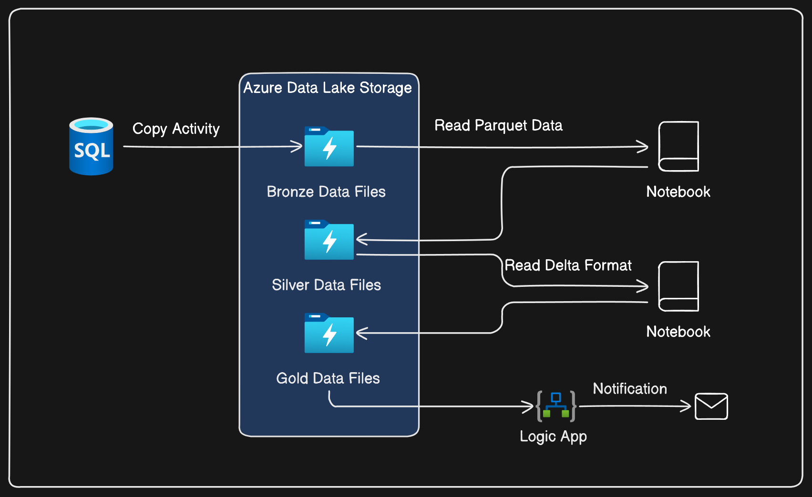
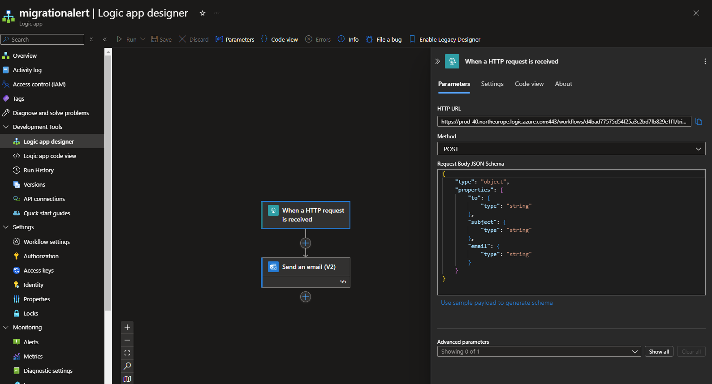
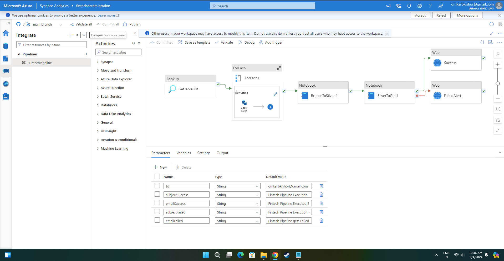

# Fintech-Data-Migration-Pipeline--Azure-Synapse-Logic-apps

## Table of Contents
- [Project Overview](#project-overview)
- [Architecture](#architecture)
- [Tech Stack](#tech-stack)
- [Pipeline Workflow](#pipeline-workflow)
- [Challenges and Solutions](#challenges-and-solutions)
- [Contact](#contact)

## Project Overview
This project demonstrates an end-to-end ETL (Extract, Transform, Load) pipeline using various Azure services, including Azure Synapse Analytics, Azure Logic Apps, and Azure SQL Database. The pipeline ingests data from an SQL database, performs transformations, and stores the data in different stages (Bronze, Silver, Gold) in Azure Data Lake Storage (ADLS).

## Architecture

## Tech Stack
- **Languages**: Python, SQL
- **Azure Synapse Analytics:** Orchestrates the entire pipeline.
- **Azure SQL Database:** Source database containing the raw tables.
- **Azure Data Lake Storage (ADLS):** Storage for Bronze, Silver, and Gold data.
- **Azure Logic Apps:** Automates notifications for pipeline runs.
- **Delta Lake:** Provides ACID transactions and scalable metadata handling.
- **Version Control**: Git

## Pipeline Workflow
1. **Copy Data from SQL Database to ADLS (Bronze Layer):**

* **Activity:** Copy data from each SQL table to a corresponding folder in the "bronze data" folder in ADLS make use of dynamic variable and parameters to get the schema name and table name and iterate using for each loop activity.
* **Format:** Data is stored in Parquet format in the Bronze folder to optimize storage efficiency and improve query performance.
2. **Transform Data (Silver Layer):**

* **Activity:** Use Azure Notebook to read the Parquet files, perform transformations, handle null values, and derive new columns.
* **Format:** Transformed data is saved in Delta format in the "silver data" folder in ADLS.
3. **Aggregate Data (Gold Layer):**

* **Activity:** Read Silver data, perform aggregations, and save the results in the "gold data" folder in ADLS.
* **Format:** Aggregated data is stored in Delta format.
4. **Notification Setup:**

* **Activity:** Use Logic Apps and Web Activity in Synapse web activity to send a POST request to the logic app trigger then it will performa action of notifying via Outlook email about the pipeline run's status.

1. **Pipeline Structure**:
    - 
    - This screenshot shows the overall structure of the ETL pipeline.

## Challenges and Solutions
**Challenge 1**: making linked services to connect to the azure synapse with proper permissions.
- Solution: use system-assigned managed identity as authentication type for azure datalake storage in azure synapse 

**challenge 2:** long waiting time during pipeline run at notebook activity.

- Solution: first make sure you create spark pool and is up and running then while triggering pipeline for notebook activity just assign or attach dedicated spark pool 
don't put minimum and maximum number of executors while running pipeline azure will automatically decide it.

## Contact
<a href="https://www.linkedin.com/in/omkar-desai-0075a7192/">LINKEDIN</a>
